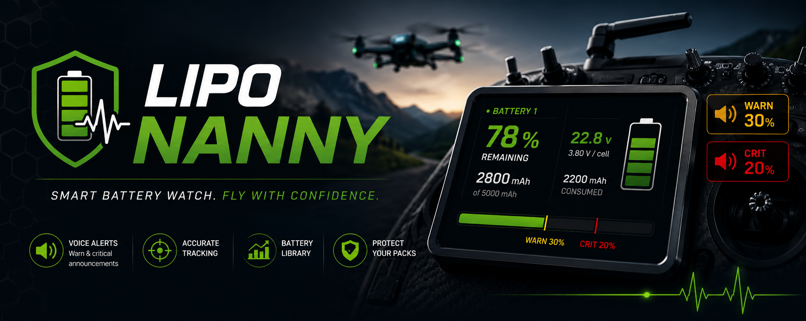

# edgetx-lipo-nanny

EdgeTX Lua script that tracks battery voltage and capacity, alerting the pilot before critical battery conditions occur.

---

## 📚 Table of Contents

- [📋 Compatibility](#-compatibility)
- [🎯 What is it for?](#-what-is-it-for)
- [🧰 Requirements](#-requirements)
- [📥 Installation](#-installation)
- [🛠️ Troubleshooting](#-troubleshooting)
- [🤝 Contributing](#-contributing)
- [⚠️ Disclaimer](#-disclaimer)
- [📄 License](#-license)

---

## 📋 Compatibility

| Component   | Minimum Version | Tested On | Test Hardware                              |
|-------------|-----------------|-----------|--------------------------------------------|
| EdgeTX      | v2.11           | v2.12.0   | Radiomaster TX15, Radiomaster TX16S MK3    |
| ExpressLRS  | v3.0.0          | v4.0.0    | Radiomaster RP1 V2, RP3 V2, RP4TD          |

---

## 🎯 What is it for?

Lipo Nanny lets RC pilots focus on flying. The EdgeTX script watches the flight battery over your model's telemetry (ELRS/CRSF out of the box, other systems via per-model sensor mapping) and speaks up on its own: twice per flight, when it's time to return and when it's time to land.

It solves three concrete problems:
- **Deep discharge** that permanently damages LiPo cells.
- **Guesswork about remaining flight time** during the flight.
- **Crashes from a battery noticed too late.**

**How it works**

- At connect, the script reads the resting voltage, auto-selects the matching battery from a per-model library (or lets you pick when several fit), and estimates the starting state-of-charge from a chemistry-specific voltage curve (LiPo, LiPoHV, LiIon).
- During flight, the FC-reported consumed-mAh counter (CRSF `Capa` by default) is offset by the start SoC, so remaining capacity reflects reality from the first second.
- **Telemetry-system agnostic:** the four sensors (voltage, current, consumed mAh, link) default to the CRSF/ELRS names but are remappable **per model** in the tool, so FrSky S.Port and other systems work too.
- Two one-shot voice announcements fire on percentage thresholds: **warn** (default 30 %) and **critical** (default 20 %), both globally tunable and per-profile overridable.
- Per physical **pack** (#1, #2, …) the script keeps a **cycle count**.
- Each pack can carry a **wear %** that lowers its effective capacity, so an aging battery triggers the warnings **earlier**; there's no need to re-tune your thresholds as a battery gets tired.

---

## 🧰 Requirements

- A radio running EdgeTX 2.11 or newer (color-display models only)
  > `v2.11` is a hard minimum: the widget's **Theme** selector uses a `CHOICE` widget option that EdgeTX only supports from 2.11 onward.
- A receiver that reports battery telemetry: at minimum **voltage** and **consumed mAh**
  > ExpressLRS ≥ 3.0 works out of the box (default sensor names `RxBt`/`Curr`/`Capa`/`RQly`). Other systems (e.g. FrSky S.Port with `VFAS`/`Cur`/`mAh`/`RSSI`) are supported by remapping the sensors **per model** in the tool. `v3.0.0` is the earliest ELRS version verified on hardware.

---

## 📥 Installation

1. **Copy the script files** onto the radio's SD card:
   - `/WIDGETS/LIPONY/main.lua`: the telemetry widget (runtime logic + warnings)
   - `/SCRIPTS/TOOLS/LIPONY.lua`: the configuration tool
   - `/SCRIPTS/LIPONY/`: an (initially empty) data folder the tool writes `config.lua` into.

2. **Add the voice files** so the warnings are actually spoken. Supply your own WAV files at:
   - `/SOUNDS/en/scripts/LIPONY/warn.wav`: early warning (e.g. *"return to home"*)
   - `/SOUNDS/en/scripts/LIPONY/crit.wav`: critical warning (e.g. *"land now"*)

3. **Restart the radio** (or reload Lua scripts) so EdgeTX picks up the new files.

4. **Create your configuration**: open **Tools → Lipo Nanny** and set up:
   - at least one **battery profile** (manufacturer, chemistry, capacity, cell count, packs)
   - the **model settings** for the active model (cell count, single vs. parallel, assigned batteries)
   - *(only if you don't use ELRS/CRSF)* the **sensor mapping** under **Models → Sensors**: point the four sensors at your system's telemetry names

5. **Place the widget**: add the **Lipo Nanny** widget to a telemetry screen. It only runs while it is placed on a page.

6. *(Optional)* Open the widget settings to adjust:
   - **Theme** — `Dark` / `Light`.
   - **Transparency** — milky-overlay transparency level (light theme only).
   - **TxtColor** — color of the heading / brand text: `Default` (the classic green), `Theme` (the focus color of your active EdgeTX theme), or `Custom` (pick any color via **CustomCol**).

   > 📐 **Recommended screen layouts:** EdgeTX names its widget-screen layouts `columns × rows` (e.g. `2×4` = 2 columns next to each other, 4 rows on top of each other → 8 zones). The Lipo Nanny widget is designed for a **half-width** zone, so it looks best in the layouts with **2 columns**:
   >
   > - **2×2** — half width, half height (the quarter-tile). This is the primary use case and shows the full layout with every value.
   > - **2×3** — half width, one third height. Slightly shorter, so the widget automatically switches to a more compact layout.
   > - **2×4** — half width, one quarter height. The shortest supported zone; it falls back to the most compact layout to stay readable.

> Detailed configuration and in-flight usage: see [`docs/configuration.md`](docs/configuration.md) and [`docs/usage.md`](docs/usage.md).

---

## 🛠️ Troubleshooting

If something's off, the widget tile usually tells you what:

| Tile shows | Meaning / fix |
|---|---|
| `No Battery connected…` | No link / no battery yet. Power the model and check the ELRS connection. (`Calculating…` once the link is up, `USB connected` when on USB power.) |
| `Sensor missing` | A required sensor (voltage or consumed-mAh, `RxBt`/`Capa` by default) isn't present. Run **Discover sensors** in EdgeTX telemetry, or remap the sensor names under **Tools → Lipo Nanny → Models → Sensors**. |
| `Setup required` | No configuration yet. Open **Tools → Lipo Nanny** and create it. |
| `Config invalid` | `config.lua` is corrupt or has the wrong schema version. Recreate it in the tool, or fix/delete it on the PC. |
| `Model not configured` | The active model has no entry. Add it in **Tools → Lipo Nanny → Models**. |
| `No batteries assigned` | Assign at least one matching battery profile to the model. |
| `Cell count mismatch` | No assigned profile matches the model's cell count. |
| `Widget error` | An internal fault. Remove and re-add the widget, or restart the radio. |

**No voice warning?** Check that `warn.wav` / `crit.wav` exist and the radio volume is up.

**Tool says "Save failed" on first run?** The data folder `/SCRIPTS/LIPONY/` is missing. Create it on the SD card (EdgeTX/Lua can't create folders itself), then retry.

> More cases and fixes: see [`docs/troubleshooting.md`](docs/troubleshooting.md).

---

## 🤝 Contributing

Found a bug, have an idea for an improvement, or running an FC firmware whose flight-mode strings aren't covered yet? Please [open an issue](../../issues) on GitHub. Pull requests are welcome too.

---

## ⚠️ Disclaimer

This script is provided **as is** and is intended as a pilot aid only. It monitors battery voltage and capacity reported via telemetry and raises audible/visual warnings when configurable thresholds are reached. It does **not** replace the pilot's own battery management, careful flight planning, or visual monitoring of the aircraft. Telemetry can be delayed, noisy, or temporarily lost (signal dropouts, sensor issues, incorrect cell-count detection), and the script cannot warn about conditions it does not see. Always land with a safe voltage and capacity reserve, treat the warnings as a backup, not a substitute, for your own judgement, and rely on the safety mechanisms of your transmitter, receiver and flight controller. Use at your own risk.

---

## 📄 License

Released under the [GNU General Public License v2.0](LICENSE).
