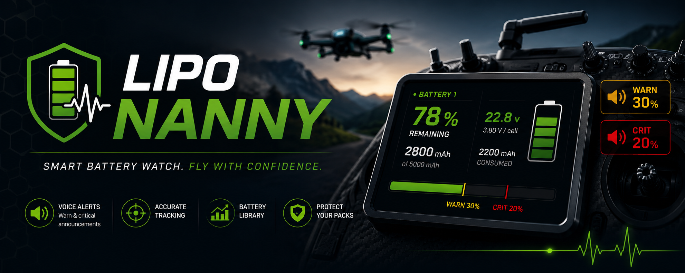
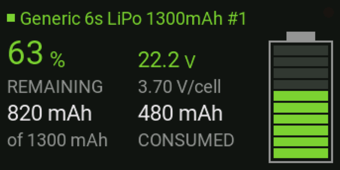
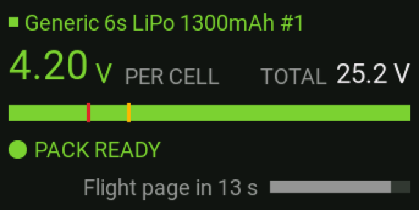
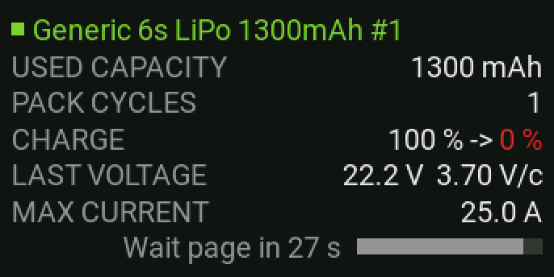

# edgetx-lipo-nanny



EdgeTX Lua script that tracks battery voltage and capacity, alerting the pilot before critical battery conditions occur.

[](LICENSE)
[](https://edgetx.org)
[](https://www.expresslrs.org)
[](../../issues)
[](../../commits/main)
[](https://www.buymeacoffee.com/mariatorpro)

---

## 📚 Table of Contents

- [📋 Compatibility](#-compatibility)
- [🎯 What is it for?](#-what-is-it-for)
- [🧰 Requirements](#-requirements)
- [📥 Installation](#-installation)
- [🛠️ Troubleshooting](#-troubleshooting)
- [🤝 Contributing](#-contributing)
- [⚠️ Disclaimer](#-disclaimer)
- [📄 License](#-license)

---

## 📋 Compatibility

| Component   | Minimum Version | Tested On | Test Hardware                              |
|-------------|-----------------|-----------|--------------------------------------------|
| EdgeTX      | v2.11           | v2.12.4   | Radiomaster TX15, Radiomaster TX16S MK3    |
| ExpressLRS  | v3.0.0          | v4.1.0    | Radiomaster RP1 V2, RP3 V2, RP4TD          |

> Flight controllers (Betaflight, INAV, ArduPilot), other RC links (TBS Crossfire, ImmersionRC Ghost, FrSky ACCESS) and the settings they need: see [`docs/compatibility.md`](docs/compatibility.md).
>
> 🙋 **Help wanted:** most of these combinations are checked in the source code only, not yet on real hardware. If you fly one of them, a test would help a lot. Any feedback, working or not, is welcome: please [open an issue](../../issues).

---

## 🎯 What is it for?

Lipo Nanny lets RC pilots focus on flying. The EdgeTX script watches the flight battery over your model's telemetry (ELRS/CRSF out of the box, other systems via per-model sensor mapping) and speaks up on its own: twice per flight, when it's time to return and when it's time to land.

<p align="center">
  
</p>

It solves three concrete problems:
- **Deep discharge** that permanently damages LiPo cells.
- **Guesswork about remaining flight time** during the flight.
- **Crashes from a battery noticed too late.**

**How it works**

- At connect, the script reads the resting voltage, auto-selects the matching battery from a per-model library (or lets you pick when several fit), and estimates the starting state-of-charge from a chemistry-specific voltage curve (LiPo, LiPoHV, LiIon).
- During flight, the FC-reported consumed-mAh counter (CRSF `Capa` by default) is offset by the start SoC, so remaining capacity reflects reality from the first second.
- Two one-shot voice announcements fire on percentage thresholds: **warn** (default 30 %) and **critical** (default 20 %), both globally tunable and per-profile overridable. A pack that is already below the warn threshold when plugged in gets a **not charged** announcement instead. An optional **haptic buzz** (one pulse on warn and not charged, two on critical) can accompany them.
- Per physical **pack** (#1, #2, …) the script keeps a **cycle count** plus read-only **statistics** (lifetime consumed mAh, lowest cell voltage seen, and the last-used date), all viewable per profile in the tool.
- Each pack can carry a **wear %** that lowers its effective capacity, so an aging battery triggers the warnings **earlier**; there's no need to re-tune your thresholds as a battery gets tired. An optional **purchase date** per pack helps track battery age.

Besides the flight view above, the widget shows a page for each other phase of a flight:

<table>
  <tr>
    <td align="center"></td>
    <td align="center"></td>
    <td align="center"></td>
  </tr>
  <tr>
    <td align="center"><b>Waiting</b><br>no battery connected</td>
    <td align="center"><b>Preflight</b><br>pack check before take-off</td>
    <td align="center"><b>End</b><br>the flight's pack summary</td>
  </tr>
</table>

---

## 🧰 Requirements

- A radio running EdgeTX 2.11 or newer (color-display models only)
  > `v2.11` is a hard minimum: the widget's **Theme** selector uses a `CHOICE` widget option that EdgeTX only supports from 2.11 onward.
- A receiver that reports battery telemetry: at minimum **voltage** and **consumed mAh** (or the remaining percent)
  > ExpressLRS ≥ 3.0 works out of the box (default sensor names `RxBt`/`Curr`/`Capa`). Other systems are supported by remapping the sensors **per model** in the tool, see [`docs/compatibility.md`](docs/compatibility.md). `v3.0.0` is the earliest ELRS version verified on hardware.

---

## 📥 Installation

1. **Copy the files onto the radio's SD card.** Copy the folders below as a whole to the same locations, so files not listed here (like the Flight Bag icon) come along. `core.lua` holds the shared logic; the widget and Flight Bag load it at startup. Only `config.lua` is created automatically, on first save.

   ```
   SCRIPTS/
   ├── LIPONY/
   │   ├── core.lua            ← shared logic
   │   └── manifest.lua        ← Flight Bag settings
   ├── FLIGHTBAG/              ← Flight Bag pages
   └── TOOLS/
       └── FLIGHTBAG.lua       ← Tools menu entry
   WIDGETS/
   └── LIPONY/
       └── main.lua            ← widget
   SOUNDS/
   └── en/
       └── SCRIPTS/
           └── LIPONY/         ← all .wav files
   ```

   `warn.wav`, `crit.wav` and `charge.wav` ship with the project as the default voices. Drop additional named `*.wav` files into the same folder to pick them per warning under **Tools → Flight Bag → Alerts**, or set a warning to **Off** there to silence its voice. The WAVs always live under `/SOUNDS/en/SCRIPTS/LIPONY/` regardless of the radio's language setting; the script plays them by absolute path.

2. **Restart the radio** (or reload Lua scripts) so EdgeTX picks up the new files.

3. **Create your configuration**: open **Tools → Flight Bag** (tap the Lipo Nanny icon and press **Create** on first use) and set up:
   - at least one **battery profile** (manufacturer, chemistry, capacity, cell count, packs)
   - the **model settings** for the active model (cell count, single vs. parallel, assigned batteries)
   - *(only if you don't use ELRS/CRSF)* the **sensor mapping** under **Models → Sensors**: point the three sensors at your system's telemetry names
   - *(optional)* the global thresholds on **Warnings** and the per-warning sounds and vibration on **Alerts**

4. **Place the widget**: add the **Lipo Nanny** widget to a telemetry screen. It only runs while it is placed on a page.

5. *(Optional)* Open the widget settings to adjust:
   - **Theme**: `Dark` / `Light`.
   - **Transparency**: how much of the radio theme shows through the milky background (light theme only): `0%` opaque, `100%` no overlay.
   - **Accent**: color of the heading / brand text. `Default` (the classic green), `Theme` (the focus color of your active EdgeTX theme), or `Custom` (pick any color via **AccentColor**).

> **Updating from an older version?** Flight Bag removes the old "Lipo Nanny" Tools entry on first start. If it still shows up, delete `/SCRIPTS/TOOLS/LIPONY.lua` by hand.

> 📐 **Recommended screen layouts:** EdgeTX names its widget-screen layouts `columns × rows` (e.g. `2×4` = 2 columns next to each other, 4 rows on top of each other → 8 zones). The Lipo Nanny widget is designed for a **half-width** zone, so it looks best in the layouts with **2 columns**:
>
> - **2×2**: half width, half height (the quarter-tile). This is the primary use case and shows the full layout with every value.
> - **2×3**: half width, one third height. Slightly shorter, so the widget automatically switches to a more compact layout.
> - **2×4**: half width, one quarter height. The shortest supported zone; it falls back to the most compact layout to stay readable.

> Detailed configuration and in-flight usage: see [`docs/configuration.md`](docs/configuration.md) and [`docs/usage.md`](docs/usage.md).

---

## 🛠️ Troubleshooting

If something's off, the widget tile usually names the problem. In most cases, **Tools → Flight Bag** shows a warning sign on the Lipo Nanny icon; tap it to see what is wrong.

All tile and popup messages and their fixes: see [`docs/troubleshooting.md`](docs/troubleshooting.md).

---

## 🤝 Contributing

Found a bug, have an idea for an improvement, or running an FC firmware whose flight-mode strings aren't covered yet? Please [open an issue](../../issues) on GitHub. Pull requests are welcome too.

---

## ⚠️ Disclaimer

This project is provided **as is** and is intended as an additional aid only. It does **not** replace your own battery management, your judgement, or the safety mechanisms of your transmitter, receiver and flight controller. Always land with a safe reserve. Use at your own risk.

---

## 📄 License

Released under the [GNU General Public License v2.0](LICENSE).
