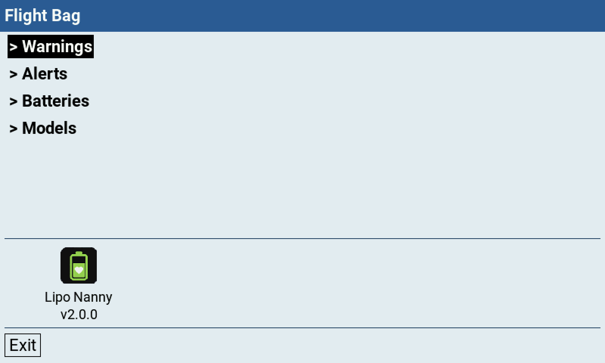
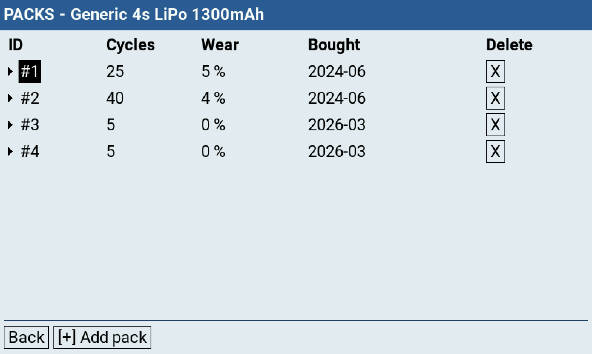

# Configuration

All configuration happens in the **Tools → Flight Bag** tool on the
radio. It writes a single `config.lua` into `/SCRIPTS/LIPONY/`, which the widget
reads at runtime. You never have to edit files on the PC.

> **Flight Bag** is a small launcher that collects the settings of all installed
> scripts under one Tools menu entry.

---

## Menu overview

The start page lists the topic pages on top and the installed scripts as icons
below (plus **Exit**). Lipo Nanny uses these pages; other installed scripts add
their own settings to them or bring further pages:

  

| Page | What it does |
|---|---|
| **Warnings** | The global **Low** and **Critical** thresholds. |
| **Alerts** | Sounds on/off, vibration and its strength (shared by all Flight Bag scripts), and the sound per warning with a **Play** test. |
| **Batteries** | Your library of battery *profiles* (a model of battery) and their physical *packs*. |
| **Models** | Per-model setup: cell count, single vs. parallel, which batteries are assigned, sensor mapping. |

Tapping the **Lipo Nanny** icon opens a popup with the version, the project link,
**Files** (the paths on the SD card) and the resets (see below). A warning sign on
the icon means something needs attention; the popup lists what (see
[troubleshooting.md](troubleshooting.md)).

Navigation: the rotary wheel moves the cursor, **Enter** opens a folder (`>`) or
edits a field, **Exit/RTN** goes back. Fields marked `>` open a sub-page.

---

## Batteries

A **profile** describes a *type* of battery; each profile owns one or more
physical **packs** that you actually fly and that accumulate cycles.

### Profile fields

| Field | Notes |
|---|---|
| **Name** | Auto-generated as `<Manufacturer> <S>s <Chemistry> <mAh>mAh` (tagged `(auto)`). Editing it switches to a manual override; the **Reset name** button (see below) reverts it to auto. |
| **Manufacturer** | Free text, max **10 chars** (used in the auto name). **Required** (a profile won't save while it is empty). |
| **Chemistry** | `LiPo`, `LiPoHV`, or `LiIon`. Drives the resting-voltage → state-of-charge curve. |
| **Capacity** | Nominal pack capacity in mAh (**10–50000**). The **MDL** key cycles the step size 10 → 100 → 1000. |
| **Cells** | Cell count (S), **1–30**. Must match the model's cell count to be assignable. |
| **Packs** | Opens the Packs sub-page (see below). |
| **Statistics** | Opens the read-only Statistics sub-page (see below): per-pack lifetime mAh, lowest cell voltage, and last-used date. |
| **Low** | Per-profile **warn** override (**1–99 %**). Shows `… % (default)` until you set one. Low and Critical are overridden **as a pair**: as soon as you change one, the other is pinned at its current global value too, so later changes to the global thresholds (Warnings page) no longer affect this profile. Dialing both back onto the global values clears the pair. |
| **Critical** | Per-profile **critical** override. Same range and pair behaviour. Saving is blocked unless Low is above Critical. |

Buttons: **Save**, **Back**, **Delete** (existing profiles only), and **Reset
name** (only while the name is a manual override).

> **Text entry** (Name, Manufacturer): the wheel walks the character slots; **ENTER**
> on a slot opens the character ring (wheel picks the character, the **MDL** key
> switches the ring group **ABC** → **abc** → **123#**). At the right of the row sit
> two buttons: **Done** commits, and **Clear** (rightmost) empties the whole field.
> **RTN** discards the edit. The name field holds up to 30 characters; committing an
> empty Name reverts it to the auto name.

### Packs

Each row is one physical pack: **ID** (`#1`, `#2`, …), **Cycles**, **Wear**,
**Bought**, and **Delete**. Select a row and dive in to edit:

  

- **Cycles**: the stored cycle count (**0–9999**). Normally the widget increments
  it; editable here for corrections.
- **Wear %**: **0–50 %**; lowers the pack's *effective* capacity, so an aged pack
  hits the warnings **earlier**. You don't have to re-tune thresholds as a pack
  ages.
- **Bought**: an optional purchase month (`YYYY-MM`), shown as `—` until set. The
  wheel steps one month at a time (rolling into the year), seeded to the current
  month when you first set it. Purely informational, to track battery age.
- **Delete** (`X`): archives the pack (its cycle history and statistics are kept
  under the hood). You **can't remove the last pack** (delete the whole profile
  instead), and a profile used by a parallel model must keep at least two packs.

Use **[+] Add pack** to add another physical pack to the profile.

### Statistics

A **read-only** table (one row per pack) that the widget fills in automatically as
you fly (no fields to edit here, the wheel just scrolls):

| Column | Meaning |
|---|---|
| **ID** | The pack label (`#1`, `#2`, …). |
| **Cycles** | The same cycle count as on the Packs page. |
| **Life mAh** | Total consumed mAh over the pack's whole life (sum of every flight's share). |
| **Vmin** | The lowest per-cell voltage ever seen under load, or `—` if never flown. |
| **Last used** | Date of the most recent flight (`YYYY-MM-DD`), or `—`. |

These are cleared by **Reset stats** in the Lipo Nanny popup of Flight Bag (alongside the cycle counts).

---

## Models

The Models list shows every configured model; the running model is tagged
`[active]`. If the active model isn't configured yet, **[+] Add current model**
appears in the bottom bar.

### Model fields

| Field | Notes |
|---|---|
| **Cells** | The model's cell count (S). Only profiles with a matching cell count can be assigned. |
| **Parallel packs** | `Yes` if you fly two packs in parallel (shown as `#1+2`), otherwise `No`. Requires at least one assigned profile (of the model's cell count) that has **two or more packs**; the tool blocks saving otherwise. You can assign several profiles. Switching to `Yes` with single-pack profiles still assigned asks to unassign them (parallel mode only works with profiles of two or more packs). At flight time you pick the first pack, then the popup offers only **the same profile** (a different `#N`) for the second slot, so the two packs are always the same battery type. |
| **Batteries** | Opens the assignment page, where you tick the profiles that fit this model. Profiles with the wrong cell count (and, in parallel mode, those with fewer than two packs) are shown disabled. |
| **Sensors** | `default` (CRSF/ELRS names) or `custom`. Opens the sensor-mapping page. |

Buttons: **Save**, **Back**, and **Delete** (existing model configs only).

### Sensors (per model)

Only needed if you don't use ELRS/CRSF. Three telemetry sources are mapped, plus the unit of the capacity sensor:

| Sensor | Default name | Used for |
|---|---|---|
| **Voltage** | `RxBt` | Resting voltage → start SoC, and the live V/cell readout. |
| **Current** | `Curr` | Live current draw. |
| **Capacity** | `Capa` | Consumed mAh, the main remaining-% driver. |
| **Capacity unit** | `mAh used` | Set to `% remaining` only if your FC sends the remaining percent instead of consumed mAh. |

Point each one at your system's telemetry name. The sensors can only be edited for
the active model (the one loaded on the radio). Which names and settings your
flight controller and RC link need: see [`compatibility.md`](compatibility.md).
The link state needs no mapping, it comes from the radio itself for every
telemetry system.

> **% remaining:** the script converts the percent into consumed mAh using the
> capacity of the selected battery profile. This is only correct if the battery
> capacity set in the flight controller is **exactly** the profile's capacity in
> mAh (for parallel packs: the sum of both).

**Reset to CRSF defaults** (shown only when a
custom mapping is set) restores the default names. The mapping is saved together
with the model.

---

## Warnings and Alerts (global)

Both pages gather the settings of all installed scripts; Lipo Nanny's rows sit
under the heading **Lipo Nanny**. **Save** writes them, **Back** asks before
discarding changes.

**Warnings page**

| Row | Notes |
|---|---|
| **Low** | The first voice warning, default **30 %** remaining (**1–99 %**). |
| **Critical** | The second voice warning, default **20 %** (**1–99 %**). Saving is blocked unless **Low is above Critical**. |

**Alerts page**

The shared rows on top apply to all Flight Bag scripts at once. If the scripts
were set differently before, the row shows **Mixed** until you choose a value.

| Row | Notes |
|---|---|
| **Sounds** | `On` (default) / `Off`. **Off** silences every warning at once, whatever each warning's sound is; vibration stays. The sound rows are then greyed out. |
| **Vibration** | `On` / `Off` (default **Off**). When on, the radio buzzes alongside each voice warning. Has no effect on radios without a vibration motor. |
| **Strength** | `Soft` / `Normal` (default) / `Strong`, setting the pulse length. Greyed out while **Vibration** is off. |
| **Low** / **Critical** (sound) | Dive into the row to reach the sound and the **Play** button. The sound is **Off**, **Default** (the bundled `warn.wav` / `crit.wav`), or any custom `*.wav` you've dropped into `/SOUNDS/en/SCRIPTS/LIPONY/`, picked from a list. A selected file that later goes missing falls back to the default. **Off** silences **only that warning's voice**; with vibration on, the buzz still fires. **Play** plays the selected sound (and, with vibration on, its buzz: one pulse for Low, two for Critical), so you can check it exists and the volume is up. |

Per-profile **Low/Critical** overrides (above) take precedence over these global
threshold values for that profile. Profiles from older versions that carry only one
of the two values are completed automatically the first time the Batteries page opens (the
missing value is pinned at the global value in effect at that moment).

The resets sit in the popup that opens when you tap the Lipo Nanny icon in Flight Bag.
Each one asks for confirmation first. **Sounds** and **Haptic** are shared by all
Flight Bag scripts, so no reset changes them.

| Button | Notes |
|---|---|
| **Reset settings** | Restores the thresholds and warning sounds to their defaults. Batteries, models and all statistics are kept. |
| **Reset stats** | Zeroes every pack's **cycle count and statistics** (Life mAh, Vmin, Last used) and empties the archive. Profiles and models are kept. |
| **Factory reset** | Erases **all** batteries, models, statistics and settings. |

> Changes you save in the tool are picked up by a running widget within a few
> seconds (it re-reads `config.lua` on its own), so no radio restart is needed.
> Without a config yet, the Lipo Nanny icon carries a warning sign; press
> **Create** in its popup (or on the Warnings or Alerts page) to write the defaults.

---

## Widget options

These are set in EdgeTX's own **widget settings** (long-press the widget /
*Edit*), not in the tool:

| Option | Values | Effect |
|---|---|---|
| **Theme** | `Dark` (default) / `Light` | **Dark** paints its own near-black panel so the tile looks identical on any radio theme. **Light** is transparent, so your radio theme shows through, with black text. |
| **Transparency** | `0%` to `100%` (default `40%`) | How much of the radio theme shows through the milky overlay, applied **only in the Light theme** (`0%` = opaque, `100%` = no overlay). Ignored in Dark. |
| **Accent** | `Default` / `Theme` / `Custom` | Colour of the **heading / brand text only**: the `LIPO-NANNY` splash, error/info headings, the `■ pack` label, and the selection-popup title/cursor. **Default** keeps the classic green (each theme its own shade). **Theme** uses your active EdgeTX theme's focus colour. **Custom** uses the **AccentColor** value below. The battery/state colours (bar, %, voltage, warn/crit) are **never** affected by this option. |
| **AccentColor** | colour picker (default: the classic green) | The colour used when **Accent** = `Custom`. Opens EdgeTX's native colour picker; ignored for `Default` / `Theme`. |

---

## How the numbers fit together

1. At connect, the widget reads **resting voltage**, auto-selects the pack when
   exactly one matches (otherwise it asks; see the selection popup in
   [usage.md](usage.md)), and estimates **start SoC** from the chemistry curve.
2. In flight, the FC's **consumed-mAh** counter is offset by that start SoC, so
   remaining % is realistic from the first second.
3. **Wear %** shrinks effective capacity; the warn/critical thresholds fire on
   the resulting remaining %.

See [usage.md](usage.md) for what happens in the air, and
[troubleshooting.md](troubleshooting.md) if a tile shows an error.
