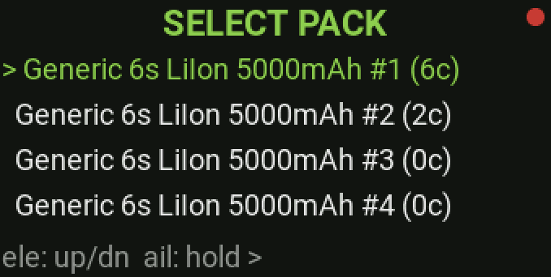
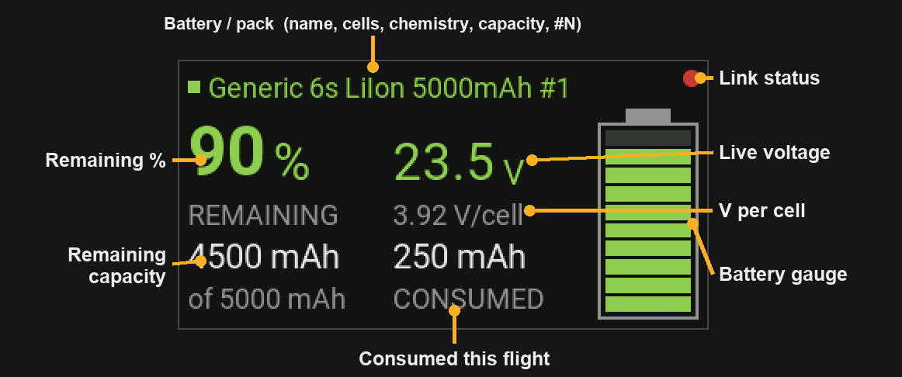

# In-flight usage

Once configured (see [configuration.md](configuration.md)) and placed on a
telemetry screen, the **Lipo Nanny** widget runs on its own. Nothing to press in
the air: it watches the battery and speaks up twice per flight.

> The widget only runs while it is **placed on a page**. If you remove it from
> every screen, it stops monitoring.

---

## The flight cycle

The widget moves through three states:

1. **Waiting**: no battery or link yet. The tile shows a `LIPO-NANNY` branding
   splash with a status line:
   - `No Battery connected…` while waiting for telemetry.
   - `Calculating…` once the link is up and it settles on the resting voltage.
   - `USB connected` when the radio is on USB power (no real flight battery).
2. **Connected**: a battery is detected and identified. The tile shows the live
   readout (see below). The pack is **auto-selected when exactly one** matches
   the resting voltage; if several (or none) clearly match, you're asked to pick
   first. Parallel models always prompt for both slots.
3. **Ended**: link lost or battery unplugged. After a short grace period the
   flight is closed out (cycle counting happens here) and a **flight summary** is
   shown: `Flight ended`, the pack label, `Used X mAh (Y %)`, `Last: X V/cell`,
   and `Total pack cycles (N)`. It returns to **Waiting** after ~30 s, or
   immediately if you plug in again.

---

## Choosing the battery (selection popup)

When the pack can't be auto-selected (several assigned profiles fit the voltage,
none clearly fit, or it's a parallel model) a `SELECT PACK` popup appears **right
in the widget tile**. You drive it with the **sticks**, no fullscreen or menu
needed:

  

- **Elevator up / down** moves the cursor through the list (each row shows the
  pack label and its cycle count, e.g. `6S 1300 #1 (12c)`).
- **Aileron full right, held ~1 s** (with elevator centred) confirms. A green
  fill bar grows across the row while you hold; the pick commits when it's full.

The on-screen legend reads `ele: up/dn  ail: hold >`. **Parallel** models ask for
two slots in turn — the title reads `SELECT PACK SLOT 1`, then `SELECT PACK
SLOT 2` (slot 2 lists the same profile's remaining packs); a slot with only one
candidate is taken automatically.

---

## What the tile shows in flight

  

- **Pack label**: `name #N` for a single pack, or `#1+2` for a parallel pair.
- **Remaining %**: the big number, driven by consumed mAh offset by the start
  state of charge and shrunk by the pack's **Wear %**. Coloured green / yellow /
  red against the warn / critical thresholds.
- **TIME LEFT**: estimated remaining flight time (mm:ss) from the average current
  draw down to the **critical** threshold (you should be landing by then). Shows
  `calc..` for the first 60 s while it averages, and `—:—` if there's no current
  sensor.
- **REMAINING**: remaining capacity in mAh, shown as `X` `of Y mAh` (Y = the
  effective, wear-adjusted capacity).
- **CONSUMED**: what you've actually drawn this flight (the raw mAh sensor).
- **Live voltage** (V/cell): coloured green / yellow / red from the chemistry's
  own voltage range.

---

## Voice announcements

Two one-shot voice files fire as the remaining percentage drops past the
thresholds:

| Trigger | Default | Default sound file |
|---|---|---|
| **Low / warn** | 30 % | `/SOUNDS/en/SCRIPTS/LIPONY/warn.wav` |
| **Critical** | 20 % | `/SOUNDS/en/SCRIPTS/LIPONY/crit.wav` |

- Each fires **once** per flight (it won't nag repeatedly).
- Which file plays is selectable **per warning** under **Settings → Sound** —
  `warn.wav` / `crit.wav` are just the defaults. Drop any named `*.wav` into
  `/SOUNDS/en/SCRIPTS/LIPONY/` and pick it there.
- **Optional haptic:** enable **Settings → Haptic feedback** and the radio also
  buzzes with each warning (one pulse for Low, two for Critical; strength
  selectable). No effect on radios without a vibration motor.
- If you plug in a pack that is **already below the warn threshold**, the low
  announcement is suppressed (you knowingly started part used); the critical
  announcement stays armed.
- Thresholds are global (**Settings**) and can be overridden **per profile**.
- The files are yours to supply, e.g. *"return to home"* and *"land now"*. A
  missing file just stays silent; nothing breaks.
- Placing the widget on **two** screens means two widget instances, so you may
  hear each announcement twice; that's expected, not a bug.

---

## Cycle counting, statistics & wear

- A flight adds **+1 cycle** to a pack only if it drew **more than 10 %** of that
  pack's effective capacity; brief hops or aborted launches don't count. In
  parallel the consumption is split 50/50 and each pack is judged on its share.
- At flight end the widget also records per-pack **statistics** (viewable under
  Batteries → profile → **Statistics**): lifetime consumed mAh, the lowest cell
  voltage seen under load, and the last-used date. These are logged for **every**
  used pack, even when the flight was too short to earn a cycle.
- Set a pack's **Wear %** (Batteries → profile → Packs) as it ages; the warnings
  then fire **earlier** without you re-tuning any thresholds.
- Reset all cycle counts and statistics via **Settings → Reset statistics**; the
  running widget picks the change up within a few seconds, no restart needed.

---

## Practical tips

- Let the voltage settle (the `Calculating…` phase) before launch so the start
  SoC estimate is accurate; don't launch the instant you plug in.
- Treat the announcements as a **backup**, not a substitute, for your own battery
  management and visual monitoring (see the Disclaimer in the README).
- If a tile shows an error instead of the readout, see
  [troubleshooting.md](troubleshooting.md).
