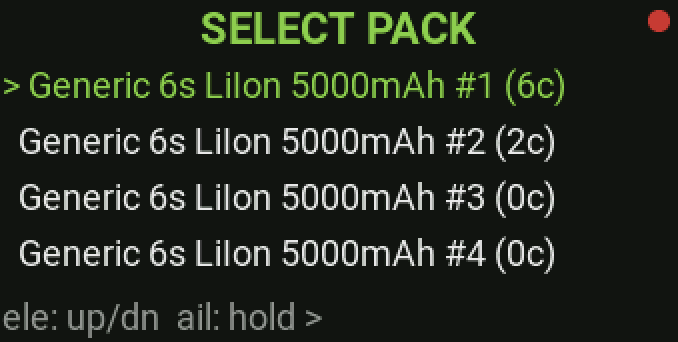
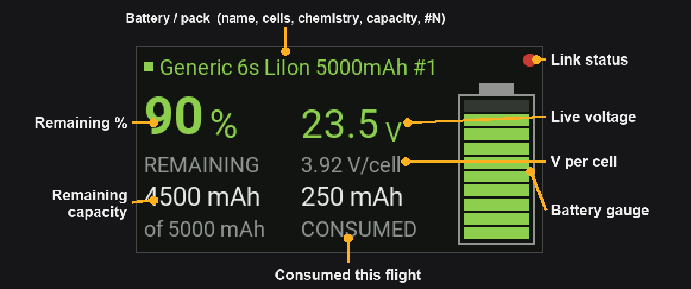

# In-flight usage

Once configured (see [configuration.md](configuration.md)) and placed on a
telemetry screen, the **Lipo Nanny** widget runs on its own. Nothing to press in
the air: it watches the battery and speaks up twice per flight.

> The widget only runs while it is **placed on a page**. If you remove it from
> every screen, it stops monitoring.

---

## The flight cycle

The widget moves through four pages:

1. **Waiting**: no battery or link yet. The tile shows a `LIPO-NANNY` branding
   splash with a status line:
   - `No Battery connected…` while waiting for telemetry.
   - `Calculating…` once the link is up and it settles on the resting voltage.
   - `USB connected` when the radio is on USB power (no real flight battery).
2. **Preflight**: a battery is detected. The pack is **auto-selected when exactly
   one** matches the resting voltage; if several (or none) clearly match, you're
   asked to pick first. Parallel models always prompt for both slots. The page
   shows the per-cell voltage (`PER CELL`), the pack voltage (`TOTAL`), the
   threshold bar and the pack check: `PACK READY` (green) or `BATTERY LOW`
   (yellow below the warn threshold, red below critical). It moves on to the
   flight page as soon as the model is armed (read from the CRSF flight mode
   `FM`), or after `PACK READY` held for 15 s (`Flight page in N s`).
3. **Flight**: the live readout (see below).
4. **Ended**: battery unplugged after a flight. After a short grace period
   (1.5 s without link) the flight is closed out (cycle counting happens here)
   and an **end page** is shown: the pack label, `USED CAPACITY` (mAh), `PACK CYCLES`, `CHARGE` (charge in % at the start and at the end, `100 % -> 23 %`),
   `LAST VOLTAGE` (pack and per cell) and `MAX CURRENT` (shortened to `USED CAP`, `LAST V` and `MAX CURR` on narrow zones), with a bar counting down 30 s at the
   bottom right. It returns to **Waiting** after
   ~30 s, or immediately if you plug in again.
   If the link drops while the model is **armed**, it is a link failure: the summary is shown and saved as well, and if the
   link is back within 30 s the same flight carries on (no new pack selection, no
   second cycle). After 30 s without link the flight is over. Without `FM` (e.g.
   FrSky) every link loss ends the flight. Unplugged on the preflight page (no flight yet):
   straight back to **Waiting**, a chosen pack is still recorded.

---

## Choosing the battery (selection popup)

When the pack can't be auto-selected (several assigned profiles fit the voltage,
none clearly fit, or it's a parallel model) a `SELECT PACK` popup appears **right
in the widget tile**. You drive it with the **sticks**, no fullscreen or menu
needed:

  

- **Elevator up / down** moves the cursor through the list (each row shows the
  pack label and its cycle count, e.g. `6S 1300 #1 (12c)`).
- **Aileron full right, held ~1 s** (with elevator centred) confirms. A green
  fill bar grows across the row while you hold; the pick commits when it's full.

The on-screen legend reads `ele: up/dn  ail: hold >`. **Parallel** models ask for
two slots in turn: the title reads `SELECT PACK SLOT 1`, then `SELECT PACK
SLOT 2` (slot 2 lists the same profile's remaining packs); a slot with only one
candidate is taken automatically.

---

## What the tile shows in flight

  

- **Pack label**: `name #N` for a single pack, or `#1+2` for a parallel pair.
- **Remaining %**: the big number, driven by consumed mAh offset by the start
  state of charge and shrunk by the pack's **Wear %**. Coloured green / yellow /
  red against the warn / critical thresholds.
- **TIME LEFT**: estimated remaining flight time (mm:ss) from the average current
  draw down to the **critical** threshold (you should be landing by then). The
  average only counts while armed and follows the last minute or so of flying.
  Shows `calc..` until 30 s of flying, and `--:--` if there's no current
  sensor or it only reads 0 A (FC without a current meter). Only on zones tall enough for it (not in the 2×2 quarter tile).
- **REMAINING**: remaining capacity in mAh, shown as `X` `of Y mAh` (Y = the
  effective, wear-adjusted capacity).
- **CONSUMED**: what you've actually drawn this flight (the raw mAh sensor).
- **Live voltage** (V/cell): coloured green / yellow / red from the chemistry's
  own voltage range.

---

## Voice announcements

Two one-shot voice files fire as the remaining percentage drops past the
thresholds:

| Trigger | Default | Default sound file |
|---|---|---|
| **Battery low** | 30 % | `/SOUNDS/en/SCRIPTS/LIPONY/warn.wav` |
| **Battery critical** | 20 % | `/SOUNDS/en/SCRIPTS/LIPONY/crit.wav` |
| **Battery not charged** | pack already below Battery low when plugged in | `/SOUNDS/en/SCRIPTS/LIPONY/charge.wav` |

- Each fires **once** per flight (it won't nag repeatedly).
- Which file plays is selectable **per warning** on the Flight Bag **Alerts** page;
  `warn.wav` / `crit.wav` / `charge.wav` are just the defaults. Drop any named `*.wav` into
  `/SOUNDS/en/SCRIPTS/LIPONY/` and pick it there, or choose **Off** to silence
  that warning's voice entirely.
- **Optional haptic:** enable **Alerts → Vibration** in Flight Bag and the radio also
  buzzes with each warning (one pulse for Battery low and Battery not charged, two for Battery critical; strength
  selectable). No effect on radios without a vibration motor. The haptic is
  independent of the voice: a warning set to **Off** still buzzes when haptic is on.
- **All sounds off:** **Sounds** `Off` in the Flight Bag Alerts page silences every
  announcement at once (shared with the other Flight Bag scripts); vibration stays.
- **Display:** each warning switches a dimmed display back on (restarts the
  backlight timeout), so a glance at the radio shows why it warned.
- If you plug in a pack that is **already below the warn threshold**, you hear
  *"battery not charged"* once instead (as soon as the pack is detected or picked).
  "Return home" and "land now" only play for thresholds crossed later, never for
  one the pack was already below on the ground.
- Thresholds are global (Flight Bag **Warnings** page) and can be overridden **per profile**.
- The files are yours to supply, e.g. *"return to home"* and *"land now"*. A
  missing file just stays silent; nothing breaks.
- Placing the widget on **two** screens means two widget instances, so you may
  hear each announcement twice; that's expected, not a bug.

---

## Cycle counting, statistics & wear

- A flight adds **+1 cycle** to a pack only if it drew **more than 10 %** of that
  pack's effective capacity; brief hops or aborted launches don't count. In
  parallel the consumption is split 50/50 and each pack is judged on its share.
- At flight end the widget also records per-pack **statistics** (viewable under
  Batteries → profile → **Statistics**): lifetime consumed mAh, the lowest cell
  voltage seen under load, and the last-used date. These are logged for **every**
  used pack, even when the flight was too short to earn a cycle.
- Set a pack's **Wear %** (Batteries → profile → Packs) as it ages; the warnings
  then fire **earlier** without you re-tuning any thresholds.
- Reset all cycle counts and statistics via **Reset stats** in the Lipo Nanny popup of Flight Bag; the
  running widget picks the change up within a few seconds, no restart needed.

---

## Practical tips

- Let the voltage settle (the `Calculating…` phase) before launch so the start
  SoC estimate is accurate; don't launch the instant you plug in.
- Treat the announcements as a **backup**, not a substitute, for your own battery
  management and visual monitoring (see the Disclaimer in the README).
- If a tile shows an error instead of the readout, see
  [troubleshooting.md](troubleshooting.md).
